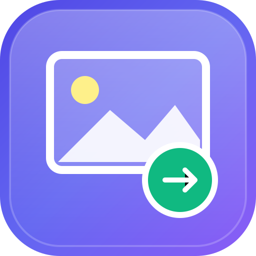

# Client-Side Image Compressor & Resizer

A modern, high-performance, 100% private in-browser image optimization suite. Compress, scale, convert, and inspect images locally without sending data to any external server.



## Key Features

- 🔒 **100% Private & In-Browser**: Images never leave your computer or phone. Processed directly in local memory via HTML5 Canvas & Web Workers.
- ⚡ **Real-Time Instant Preview**: Live quality adjustment and instant size computation.
- 🎚️ **Split-Screen Before/After Comparison**: Interactive visual inspection slider to compare original vs. compressed quality before downloading.
- 📏 **Smart Resizing & Aspect Ratio Lock**: Scale images by percentage (25%, 50%, 75%, 100%) or exact pixel dimensions with locked or unlocked aspect ratios.
- 🎯 **Target File Size Optimizer**: Automatically calculates optimal compression settings to reach a target file size (e.g., `< 100 KB`).
- 🔄 **Next-Gen Format Conversion**: Convert to **WebP**, **JPEG**, **PNG**, or **AVIF**.
- 🛠️ **Built-in Quick Tools**: 90° rotation, horizontal flip, and black & white / grayscale conversion.
- 📦 **Batch Multi-Image Processing**: Upload multiple photos at once, batch apply settings, and download all compressed files as a single **ZIP** archive.
- 📋 **Clipboard Paste & Copy**: Paste images directly with `Ctrl+V` and copy compressed PNG results straight to your clipboard.
- 📱 **Universal Cross-Device & PWA**: Works seamlessly on iPhone / iPad (iOS Safari), Android (Chrome/Samsung), macOS, Windows, Linux, Edge, and Firefox. Installable as an offline-ready Progressive Web App.

---

## Live Demo & Deployment

This application is deployed and live 24/7 on high-speed CDN.

---

## Local Development

To run locally:

```bash
# Using standard Python server
python -m http.server 8080

# Or using Node
npx serve . -l 8080
```
Open `http://localhost:8080` in your web browser.
